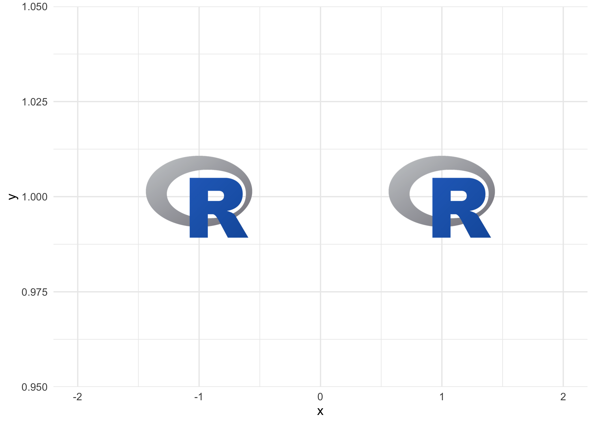
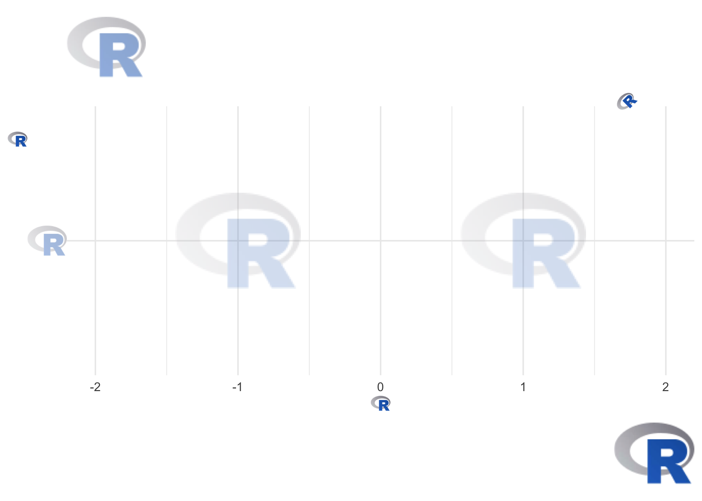

<!-- README.md is generated from README.Rmd. Please edit that file -->

# ggpath

<!-- badges: start -->
<!-- [](https://CRAN.R-project.org/package=ggpath) -->

[](https://github.com/mrcaseb/ggpath/actions/workflows/R-CMD-check.yaml)
[](https://app.codecov.io/gh/mrcaseb/ggpath?branch=main)
[](https://lifecycle.r-lib.org/articles/stages.html#experimental)
<!-- badges: end -->

ggpath is a ‘ggplot2’ extension that enables robust image grobs in
panels and theme elements. This means it helps plotting images (from
local paths, from urls or from raw image data) in nearly every part of a
ggplot.

## Comparison with Similar Image-Plotting Packages

There are various ggplot2 extensions that provide similar functionality
in terms of plotting images. These include but not limited to

-   [ggimage](https://cran.r-project.org/package=ggimage)
-   [ggpp](https://docs.r4photobiology.info/ggpp/)
-   [ggsvg](https://coolbutuseless.github.io/package/ggsvg/)
-   [ggtext](https://wilkelab.org/ggtext/)

ggpath combines the strengths of all of the above by providing

-   functions to plot images in both the panel (with
    [`geom_from_path`](https://mrcaseb.github.io/ggpath/reference/geom_from_path.html))
    and all other plot areas (with
    [`element_path`](https://mrcaseb.github.io/ggpath/reference/element_path.html)),
-   robust image aspect ratio,
-   options for changing the color of images including a grayscale
    transformation,
-   options for applying transparency, and
-   improved performance through image caching.

There are some downsides compared to the above mentioned packages, e.g.

-   cannot combine images and text to a grob as ggtext can with
    [`element_markdown`](https://wilkelab.org/ggtext/reference/element_markdown.html),
-   cannot modify css parts of svgs as [ggsvg
    can](https://github.com/coolbutuseless/ggsvg#styling-svg-with-css-aesthetics-example-1).

## Installation

The easiest way to get ggpath is to install it from
[CRAN](https://cran.r-project.org/) with:

``` r
install.packages("ggpath")
```

To get a bug fix or to use a feature from the development version, you
can install the development version of ggpath from
[GitHub](https://github.com/mrcaseb/ggpath), for example with:

``` r
if (!require("pak")) install.packages("pak")
pak::pak("mrcaseb/ggpath")
```

## Examples

The two main features to provide images in a ggplot are a geom
(geom_from_path) and a theme element (element_path). Both replace image
urls, local image paths, or raw image data with the actual image. And to
improve performance, the images are cached locally.

The below examples use local image files that are shipped with the
package. Let’s locate the images first.

``` r
local_image_path <- system.file("r_logo.png", package = "ggpath")
```

Now, we can make a simple plot, where we use the image like a point by
replacing the local path with the actual image.

``` r
library(ggplot2)
library(ggpath)
plot_data <- data.frame(x = c(-1, 1), y = 1, path = local_image_path)
ggplot(plot_data, aes(x = x, y = y)) +
  geom_from_path(aes(path = path), width = 0.2) +
  coord_cartesian(xlim = c(-2, 2)) +
  theme_minimal()
```



We can build on top of that by adding new axis labels, axis titles, plot
title and subtitle, or a caption and using the ggpath theme element.
Note the usage of transparency with the `alpha` argument, the
justification with the `hjust`/`vjust` arguments, or the rotation with
the `angle` argument.

``` r
ggplot(plot_data, aes(x = x, y = local_image_path)) +
  geom_from_path(aes(path = path), width = 0.2, alpha = 0.2) +
  coord_cartesian(xlim = c(-2, 2)) +
  theme_minimal() +
  labs(
    title = local_image_path,
    subtitle = local_image_path,
    x = local_image_path,
    y = local_image_path,
    caption = local_image_path
  ) +
  theme(
    plot.caption = element_path(hjust = 1, size = 0.6),
    axis.text.y = element_path(size = 1),
    axis.title.x = element_path(),
    axis.title.y = element_path(vjust = 0.9),
    plot.title = element_path(hjust = 0, size = 2, alpha = 0.5),
    plot.subtitle = element_path(hjust = 0.9, angle = 45),
  )
```



## ggpath Options

The option `"ggpath.cache"` can be used to configure the package cache.
It can be set with

``` r
options(ggpath.cache = "memory")
# or
options(ggpath.cache = "filesystem")
# or
options(ggpath.cache = "off")
```

The default - `"memory"` - caches in the current session, while
`"filesystem"` caches on disk which means that the cache is available
after starting a fresh session. All cache options time out after 24
hours.
